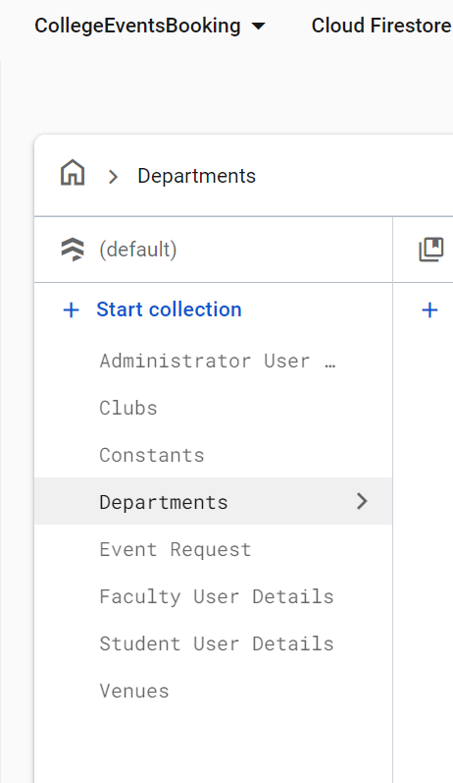
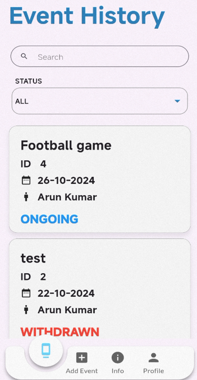
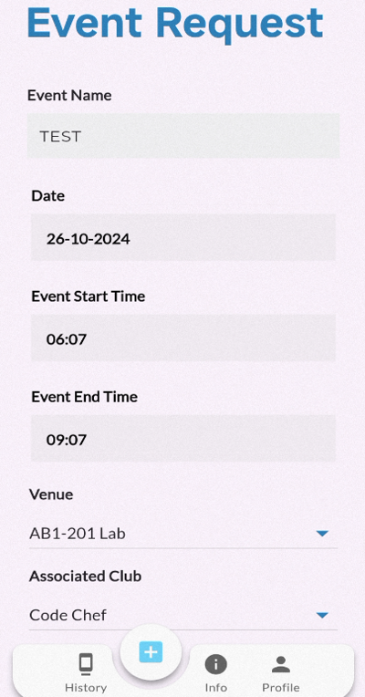
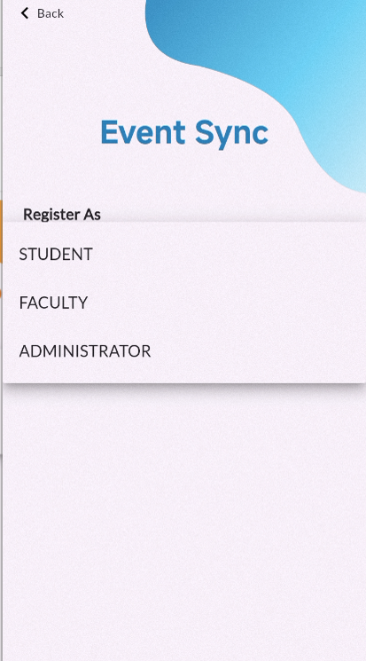

# 🎉 EventSync

**EventSync** is a Flutter-based application designed to streamline college club event registration and approval processes involving faculty and departmental heads.

---

## 🌟 Overview

EventSync is an efficient event management system where club heads can create event requests, and faculty and departmental heads can review, approve, or reject them. Once approved, events are automatically displayed on a calendar for easy tracking.

---

### ✨ Features

- 📝 **Event Request Creation**: Club heads can generate event requests with all necessary details.
- ✅ **Approval Workflow**:
  - 👨‍🏫 Faculty heads review and approve or reject the event requests.
  - 🔄 Requests can be forwarded to other faculty or the Head of Department (HOD) for final approval.
- 📅 **Calendar Integration**: Approved events are displayed on a calendar for easy reference.
- 🛡️ **Role-Based Access**:
  - 👤 **Club Heads**: Create event requests.
  - 🧑‍🏫 **Faculty**: Approve, reject, or forward requests.
  - 🎓 **HOD**: Final approval authority.
- 📢 **Streamlined Communication**: Notifications and updates are sent at every stage of the approval process.
- 🔒 **Firebase Integration**:
  - 🔑 **Authentication**: Secure user authentication for club heads, faculty, and HODs.
  - ☁️ **Cloud Firestore**: Stores all user information (faculty, students, HODs), department data, venues, and event details securely.

---

### 📸 Screenshots

| Cloud Firestore View | Event History | Event Request | Role-Based Login |
|----------------------|----------------|---------------|------------------|
|  |  |  |  |

---

## 📂 GitHub Description

This repository contains **EventSync**, a Flutter application designed for seamless college club event registration and approval. The app simplifies the event approval workflow and ensures transparency and coordination between club heads, faculty, and department heads.

---

### 🔑 Key Features

- 🗂️ **Event Management**: Simplifies event requests and approvals.
- 🛡️ **Role-Based Functionality**: Different roles for club heads, faculty, and HODs.
- 📅 **Calendar Integration**: Automatically displays approved events.
- 🔒 **Firebase Integration**:
  - 🔑 **Authentication**: Provides secure and reliable user authentication.
  - ☁️ **Cloud Firestore**: Ensures secure data storage for all users, events, and system configurations.
- 🌍 **Built with Flutter**: Ensures cross-platform support and smooth user experience.

---

### 🚀 How to Use

1. ⬇️ Download the APK file from the `Releases` section of this repository.
2. 📲 Install it on your Android device.
3. 🔐 Log in with your role (**Club Head**, **Faculty**, or **HOD**) and start managing events efficiently!

---

Feel free to 🌟 **star this project**, 🐛 **report issues**, or 🛠️ **contribute** via GitHub!
